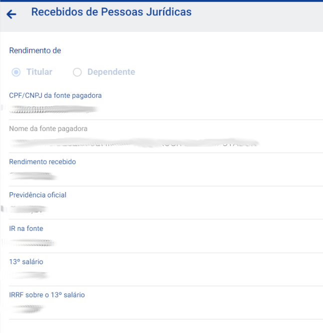

# Declaração IRPF

Projeto com o intuito de ser um guia para a declaração do IRPF

## Salário

### Pré requisitos

- Informe de rendimentos da empresa (do ano anterior)
- Caso tenha trocado de emprego, deve fazer o mesmo para cada empresa

### Declarar

- **Rendimento -> Recebidos de Pessoa Jurídica**
- Preencher todos os campos sobre a empresa e sobre o que vc recebeu
- O 13º salário é referente ao valor líquido (após descontado IRRF e Previdência)

## Ativos Financeiros

### Pré requisitos

- Preços médios de cada ativo
  1. Plataforma de controle de investimentos (Status Invest)
  2. Notas de negociação da corretora
  3. Extrato/Carteira de investimentos na corretora
- Posição no último dia útil do ano (30/12/ano)
  1. Ir ao site do CEI (Área do Investidor) e logar com seu usuário
  2. Clicar em Menu -> Extratos
  3. Selecionar a aba Posição
  4. Filtrar pelo último dia útil do ano (30/12/ano)
  5. Faça o download do extrato (PDF ou XSLX)
- Extrato de Proventos
  1. Ir ao site do CEI (Área do Investidor) e logar com seu usuário
  2. Clicar em Menu -> Proventos
  3. Selecionar a aba Recebidos
  4. Filtrar pelo período do ano inteiro (01/01/ano - 30/12/ano)
  5. Faça o download do extrato (PDF ou XSLX)
